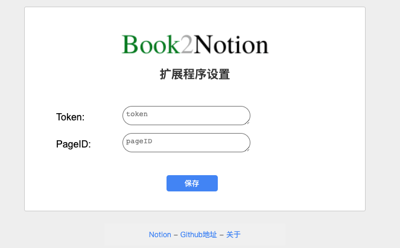
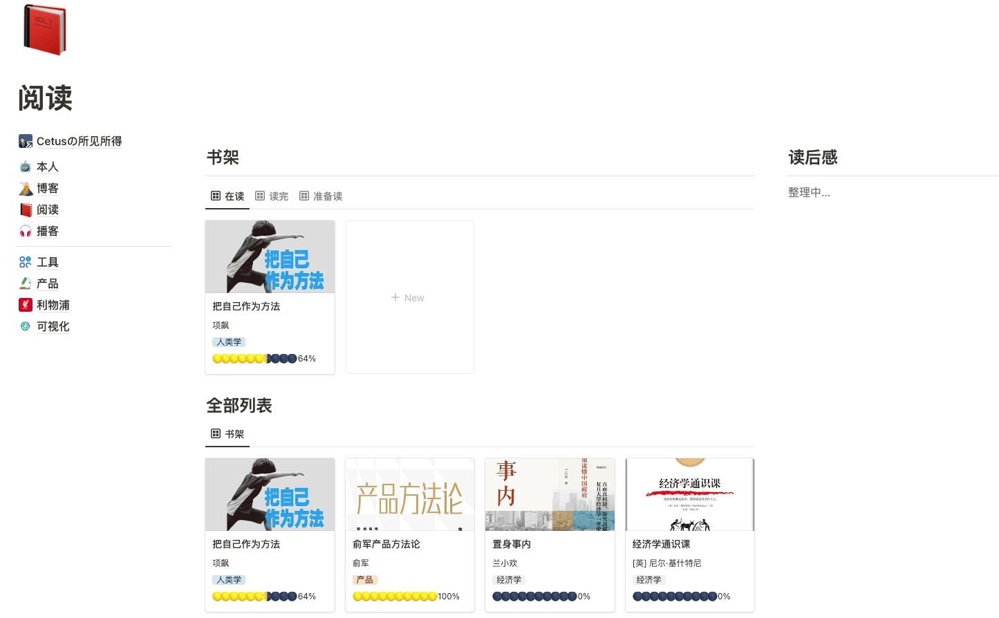

# Book2Notion：将豆瓣图书信息同步到Notion的Chrome插件
## 背景

前几天写了一个[python脚本](https://github.com/lyh081/Notion_douban)从豆瓣爬数据然后保存到Notion，被身边同学吐槽使用起来太麻烦，而且也不是所有人都会Python（原话是充满了码农版”何不食肉糜“）。正好最近在学着开发Chrome扩展，就打算把之前的脚本改成更简单易用的Chrome插件。

## 安装

1. 下载源码

   仓库地址：[Book2Notion](https://github.com/lyh081/Book2Notion)

   或者：

   ```shell
   git clone git@github.com:lyh081/Book2Notion.git
   ```

2. 安装拓展

   由于Chrome禁止安装未上传Chrome商店的crx格式插件，所以需要在开发者模式中加载已经解压的扩展程序。

   1. 在扩展程序界面（地址栏输入chrome://extensions/）点击右上角开发者模型按钮打开 **开发者模式；**
   2. 选择左上角 **加载已解压的扩展程序** ，在弹出框中选择下载的扩展文件夹。
   3. 关闭开发者模式

## 使用

1. 创建Notion机器人

   想要利用Notion提供的API对自己WorkSpace中的block进行操作的话，首先需要创建机器人（**integration**），并为机器人授予所需要操作的block操作权限。

   在 [我的机器人](https://www.notion.so/my-integrations) 页面可以快速创建机器人。填完信息点击创建之后，系统跳转到新的页面。页面最上方给出了这个机器人的Secrets ( 就是 Bearer token)，点击Show可以查看和复制。这个token会一直在这个页面，所以不用担心忘记。

   💡这个token后续会用到

   

2. 选择存放书籍信息的Notion页面

   选择存放书籍信息的Notion页面并记下该页面的ID。

   页面的ID可以就是该页面url最后的部分，例如：我的Notion主页链接为https://www.notion.so/cetus/Cetus-dfaee98a22184cb38636578b781da06d，页面ID就是 dfaee98a22184cb38636578b781da06d。这个页面ID在拓展中同样会用到。

3. 设置Book2Notion拓展

   

   在扩展程序页面 点击**详情** ，找到 **扩展程序选项** ，点击进入Book2Notion设置界面：

   

   将前两步中的Token和页面ID分别填到对应的输入框，点击保存，浏览器弹窗显示【保存并创建Database成功!】则为插件设置完成。

4. 将书籍信息保存到Notion

   在豆瓣中找到自己需要的图书主页，点击右上角拓展图标则显示当前图书信息：

   

   之后点击保存到Notion按钮就可以将相关信息保存到Notion中啦。

## 最终效果

最终Notion的效果如下图所示。目前Book2Notion支持保存的图书信息，包括 书名、封面、评分、作者、出版社、出版时间、页数、ISBN和豆瓣链接。


之后就可以基于这个Database进一步设计创建自己的其他Property和View啦！我自己阅读清单最终长这个样子：



## 注意事项

1. 用户可以Database中**添加** 任意Property，但注意请不要删除扩展自动创建的Property，不然会报错。
2. Book2Notion插件后续版本会增加自定义Proerty功能（如果真的有人需要的话）
